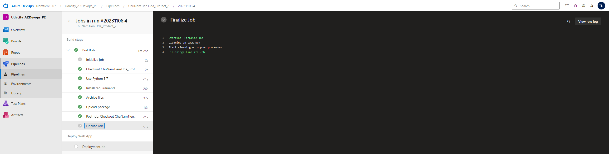
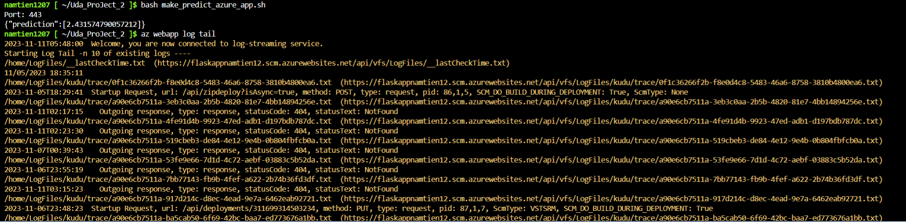

# Overview

Building a CI/CD Pipeline in Udacity Cloud DevOps using Microsoft Azure course

[](https://github.com/DucDA177/Udacity_AzureDevops_P2/actions/workflows/main.yml)

[](https://dev.azure.com/duongduc199817/Uda_AzDevops_P2/_build/latest?definitionId=4&branchName=main)

## Project Plan
<TODO: Project Plan

* A link to a Trello board for the project
 https://trello.com/invite/b/jMDDKSUt/ATTIbf61ca6984e17116c0e4d0e9fd9fe6d101F72DBB/udacityazuredevopsp2
* A link to a spreadsheet that includes the original and final project plan>
https://docs.google.com/spreadsheets/d/14PYZGnC4I2ablqw1vKQzhCvISeoMHwnTH3-ltQmLRBA/edit?usp=sharing

## Instructions

<TODO:  
* Architectural Diagram (Shows how key parts of the system work)>
<p>

</p>

### Instructions for running the Python project
#### Project cloned into Azure Cloud Shell and test
* Open Cloud shell using bash and clone project then go to project folder:

`$ git clone https://github.com/ChuNamTien/Uda_ProJect_2.git`

or

`$ git clone git@github.com:ChuNamTien/Uda_ProJect_2.git`

`$ cd Uda_ProJect_2`
<p>

</p>

* Step testing 
`$ python3 -m venv ~/.myrepo`
`$ source ~/.myrepo/bin/activate`
`$  make all`
<p>

</p>
* Testing result:
After above step you see dependencies are installed, lint rate 10/10 and tests are passed as below:
<p>

</p>
#### Project running on Azure App Service

* You can deploy this project direct to azure using command:
`az webapp up --n flaskappnamtien12 --location southcentralus --sku B1"`

And see the result deploy successfully:
<p>

</p>
Can go to the url and check as well:
<p>

</p>
Note: The app service was created before.

* Running Azure App Service from Azure Pipelines automatic deployment
<p>

</p>


* Successful prediction from deployed flask app in Azure Cloud Shell.  [Use this file as a template for the deployed prediction](https://github.com/udacity/nd082-Azure-Cloud-DevOps-Starter-Code/blob/master/C2-AgileDevelopmentwithAzure/project/starter_files/flask-sklearn/make_predict_azure_app.sh).
The output should look similar to this:

```bash
udacity@Azure:~$ ./make_predict_azure_app.sh
Port: 443
{"prediction":[20.35373177134412]}
```
If show Permission denied please try this:
```bash
$ chmod 774 ./make_predict_azure_app.sh
```

Note: I use the **LinearRegression** model, if you use other models the result can be different.

* Output of streamed log files from deployed application

https://flaskappnamtien12.scm.azurewebsites.net/api/vfs/LogFiles/2023_11_11_lw1sdlwk000AX1_default_docker.log

<p>

</p>
## Enhancements

In this project trigger only one branch. Actualy in project will work some branch(dev, staging, pre-prod, prod...)

If you want create resource fast(VM, Network, Disk...) you can:

* Using terraform file
* Create template then can create environment pipelines with ease

So that each environment we have a set of resources and its own pipeline. Developer just merge the code to target branch, pipieline will auto run
Locust load testing statics
<p>

</p>
## Demo

Youtube link [Video introduction project](https://youtu.be/z9pUjXiN9n8)